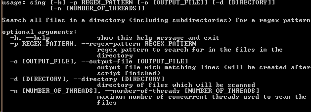

# Sing
acronym for **S**ing **i**s **n**ot **g**ood

Sing is an easy to use search tool. You can search all files in a directory and its subdirectories (or just a single file) using regular expressions and save the matching lines in an output file. Useful if you are looking for error messages in many log files.

__High Score*:__ ~__30 Seconds__ to scan __3.5 GB__ of files (8 MiB per file) (Intel i7-2630QM + SanDisk SSD)

_*Not sure if it is working 100% properly_

## Usage
### simple search in the current directory
`$python sing -p "SomeRegex"`

### specify output file
`$python sing -p "SomeRegex" -o "~/matching_lines"`

### ...and a directory
`$python sing -p "non-free" -d "/etc/apt/"`

### an advanced example
`$python sing -p "error" -o "/home/me/matching_lines" -d "/var/log/syslog" -n 8`

## Help is on the way!
just type `$python sing -h`

